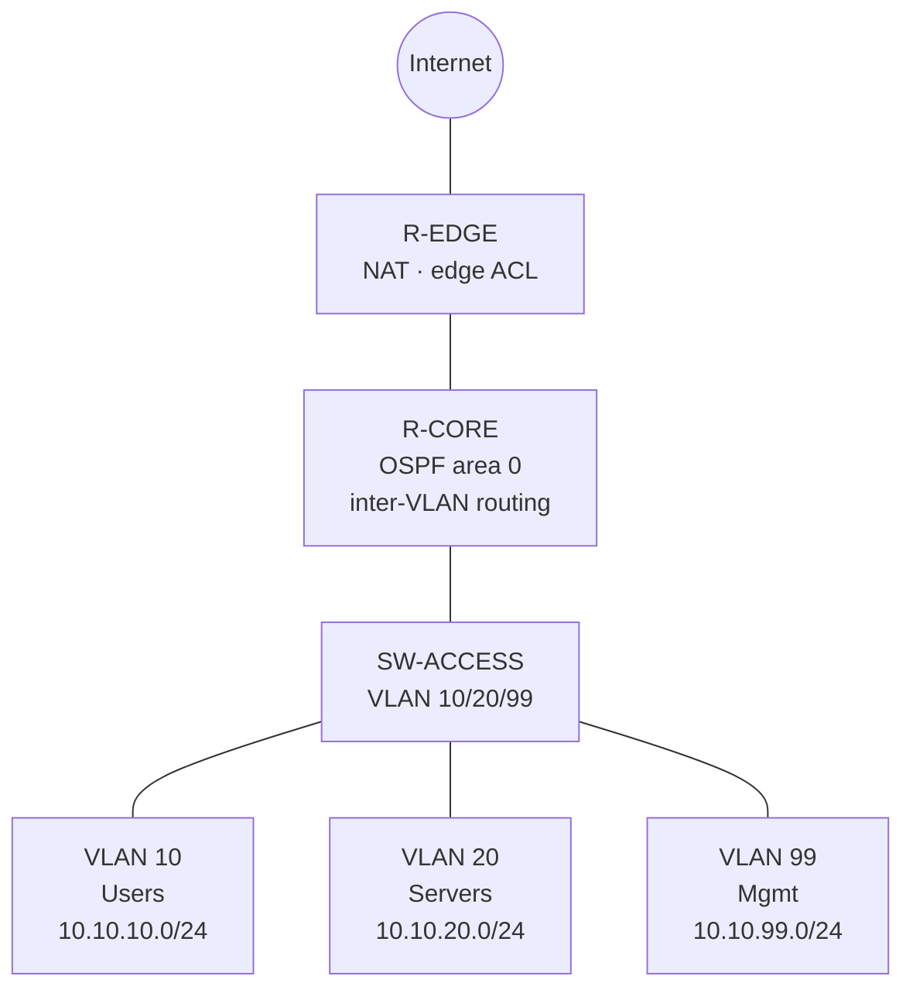

# Network Lab (EVE-NG)

> Enterprise network topologies designed and tested in EVE-NG: inter-VLAN routing, OSPF, NAT and ACLs, the kind of design validated in a lab before a production rollout.

## Topology

| Device | Role | Platform |
| --- | --- | --- |
| R-EDGE | Internet edge: NAT overload, edge ACL | Cisco IOS router |
| R-CORE | OSPF, router-on-a-stick inter-VLAN routing | Cisco IOS router |
| SW-ACCESS | VLANs, trunk, access ports | Cisco IOS switch |

## Addressing
| VLAN | Name | Subnet | Gateway |
| --- | --- | --- | --- |
| 10 | Users | 10.10.10.0/24 | 10.10.10.1 |
| 20 | Servers | 10.10.20.0/24 | 10.10.20.1 |
| 99 | Management | 10.10.99.0/24 | 10.10.99.1 |
| - | Core↔Edge | 10.0.0.0/30 | - |

## Concepts demonstrated
- **VLANs + 802.1Q trunk** between switch and core
- **Router-on-a-stick** inter-VLAN routing with sub-interfaces
- **OSPF** single-area (area 0) between core and edge
- **NAT** (PAT / overload) at the edge for internet access
- **ACLs**: deny Users→Servers management ports (applied inbound on the Users sub-interface, closest to the source), edge ACL that lets return traffic, DHCP and DNS back in, VTY locked to the mgmt VLAN

## Configurations
Cleaned configs (passwords and SSH keys removed) in [`configs/`](configs):

| File | Device |
| --- | --- |
| [`configs/R-EDGE.txt`](configs/R-EDGE.txt) | Edge router: NAT + ACL |
| [`configs/R-CORE.txt`](configs/R-CORE.txt) | Core router: OSPF + inter-VLAN |
| [`configs/SW-ACCESS.txt`](configs/SW-ACCESS.txt) | Access switch: VLANs + trunk |

## Tests
| Test | Command | Expected |
| --- | --- | --- |
| Inter-VLAN reachability | `ping 10.10.20.10` from a VLAN 10 host | Success |
| OSPF adjacency | `show ip ospf neighbor` | FULL between R-CORE and R-EDGE |
| OSPF routes learned | `show ip route ospf` | Edge sees VLAN subnets via core |
| NAT translations | `show ip nat translations` | Inside-local → inside-global entries |
| ACL enforcement | Users → Servers RDP/SSH | Blocked; web permitted |

_Fill observed output / screenshots after running._

## What I learned
- Router-on-a-stick vs an L3 switch: trade-offs in throughput and simplicity.
- An ACL applied on the wrong interface or direction silently does nothing: a standard/extended ACL is checked against the source of traffic entering that interface.
- Reading OSPF neighbor states to troubleshoot adjacency (MTU / timers / network type).
- Why ACLs are ordered and the role of the implicit deny.

> ⚠️ Lab configs only. Passwords removed; management restricted to the lab mgmt VLAN.
