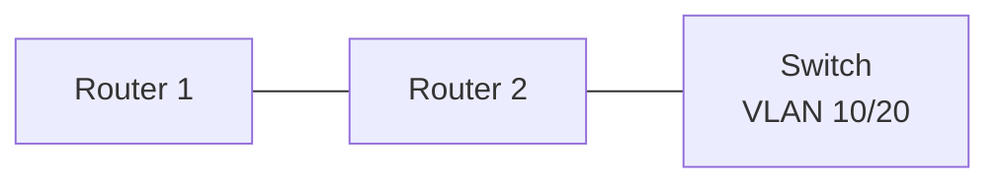

# Network Lab (EVE-NG)

> Network architectures designed and tested in EVE-NG before production rollout: routing, VLANs, NAT and ACLs.

## Topologies
| Topology | Concepts | Config files |
| --- | --- | --- |
| <!-- TODO e.g. 3-site OSPF --> | <!-- OSPF areas --> | <!-- /configs/ospf --> |

## Example diagram

## Configurations
<!-- TODO: put cleaned configs in /configs (no passwords) -->

## Tests
<!-- TODO: ping/traceroute results, show commands -->

## What I learned
<!-- TODO -->
